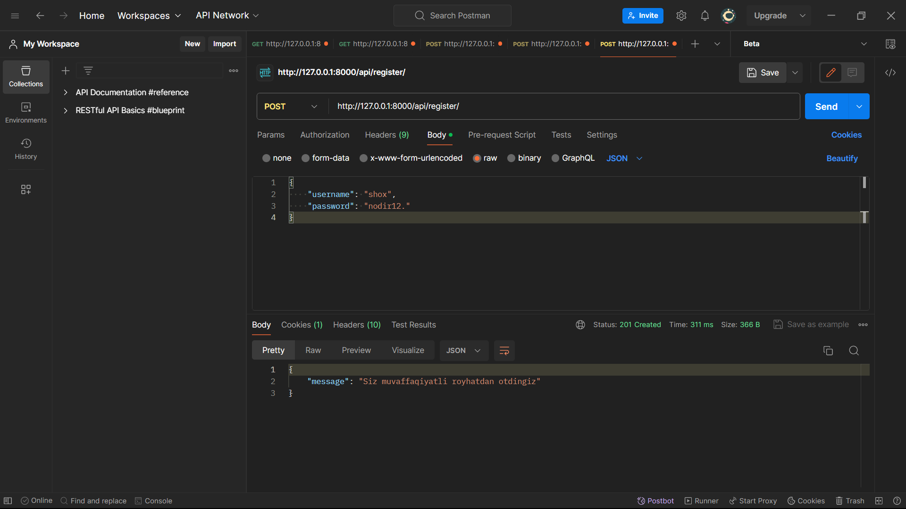
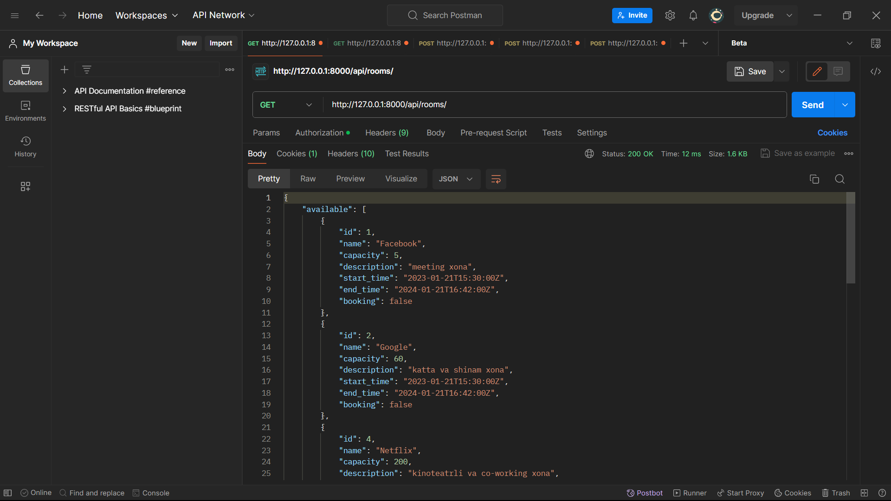

# Instalition
```bash
git clone https://github.com/abubakirovxolmirza/RoomBooking
```
```bash
docker build -t booking:1.0 .
docker run -p 1212:8000 booking:1.0
```

 HTTP so'rovlari va Javoblari

Ro’yxatini o'tish uchun `GET` :`…/api/register`


Token olish uchun `GET` :`…/api/token`


Tokenni kerakli joyga joylash


Tokenni saqlash


Barcha xonalar ro’yxatini olish uchun uchun `GET` :`…/api/rooms`


Xona haqida ma’lumot olish uchun `GET` → `…api/room/<room_name>`


Xonani bron qilish uchun esa `POST` `…/api/book/room`


Agar unday hona yoq bo'lsa


Agar band bo'lsa


